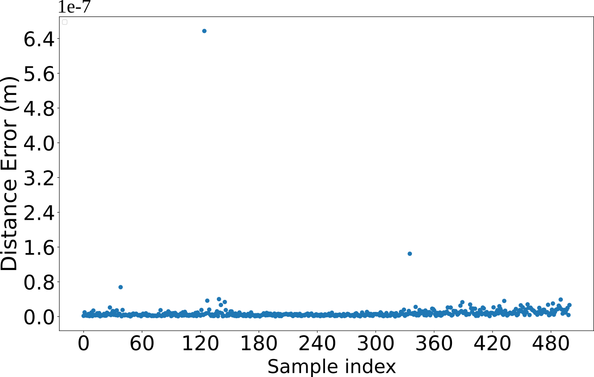

# Kinetostatic Analysis for 6RUS Parallel Continuum Robot using Cosserat Rod Theory
This repo contains the details of our investigation for Kinetostatic Analysis for 6RUS Parallel Continuum Robot presented in the paper [Kinetostatic Analysis for 6RUS Parallel Continuum Robot using Cosserat Rod Theory](https://dfki-ric-underactuated-lab.github.io/6rus_cosserat_kinetostatics/). The paper is accepted at the [Advances in Robot Kinematics 2024 Conference](https://ark2024.org/). A preprint will be published soon here.

<div align="center">
    
    
</div>
<!-- <p align="center">
  
</p> -->


## Abstract:
Parallel Continuum Robots (PCR) are closed-loop mechanisms but use elastic kinematic links connected in parallel between the end-effector (EE) and the base platform. PCRs are actuated primarily through large deflections of the interconnected elastic links unlike by rigid joints in rigid parallel mechanisms.
In this paper, Cosserat rod theory-based forward and inverse kinetostatic models of a $`6\overline{R}`$US PCR are proposed. A set of simulations is performed to analyze the proposed PCR structure, including workspace analysis, maneuverability in three-dimensional space through trajectory following, assessment of inverse kinetostatic solutions for both the $xy$ planar rotation, and evaluation of the force response at the EE platform along the $z$-axis.

**Maintainers:**
- Vinay Rodrigues [rodriguesvinay10@gmail.com](mailto:rodriguesvinay10@gmail.com)
- Bingbin Yu [bingbin.yu@dfki.de](mailto:bingbin.yu@dfki.de)

## Prequisites
The libraries used were tested successfully in Python3.8.16 and Ubuntu 18.04.6 LTS. 

## Introduction
<p align="center">
  
</p>
In this work, boundary conditions for both IK and FK are formulated for a $`6\overline{R}`$US PCR using Cosserat rod theory. A shooting method is used to iteratively solve the IVP by updating the guessed variables till the boundary value constraints are within the desired tolerance. The kinetostatic model has been analysed on a different aspect in simulation. Trajectory simulation shows the FK was able to find a solution with an error of the order $1\times10^{-7}$ under constant load condition of 5 N for a helical trajectory. Maximum load capacity and axial stiffness is estimated for the PCR by applying compressing forces at the EE. The solution for different EE rotation is studied to evalute the range of motion for the PCR. A reachable workspace is estimated for the proposed PCR using the IK model. Motor angles range for each rod are also visualised for the reachable workspace. The future work includes experimental validation of this model on the physical prototype. 


## Kinetostatic model
initial states of the rod: 
`pi0`: base position of the flexible rod,
`Ri0`: orientation at the base of the flexible rod,
`ni(0)`: internal force acting at the base of the rod,
`mi(0)`: internal moment acting at the base of the rod.

### Inverse Kinetostatic (IK) model: 
For the given pose of the end-effector `p_ee` and `R_ee`, external force `F` and moment `M` acting at the end-effector, initial states of the rod, and unknown variable vector `init_guess`, then `Inverse_Kinetostatic()` function computes the motor angles that minimizes the residual vector `residual`. `q1i`, `q2i`, and `q3i` are the motor angles, and universal joints angles respectively whereas `ni_x(0), ni_y(0), ni_z(0), mi_z(0)` are the internal forces and moments at the base of the flexible link which are unknown. Due to universal joints at the base of the rod, `mi_x(0)=mi_y(0)=0`.


File path: `./Inverse_forward kinetostatic/IK_PCR_ROD.py`

```py
p_ee = np.array([0,0,0.5]) 
R_ee = np.array([np.deg2rad(10),np.deg2rad(0),np.deg2rad(0)])

#initializing the actuator variables + universal joint values for each rod--> q=[q1, q2, q3] 
qi = np.array([0,0,0,
               0,0,0,
               0,0,0,
               0,0,0,
               0,0,0,
               0,0,0])

##initializing the guess vector for the IK model
#init_guess = [n1_x(0), n1_y(0), n1_z(0), m1_z(0),...,n6_x(0), n6_y(0), n6_z(0), m6_z(0), q1i, q2i, q3i,...,q16, q26, q36] #42 variables
init_guess = np.concatenate([np.zeros(24),qi])

q1 = Inverse_Kinetostatic(p_ee, R_ee, init_guess)

6-element Vector{Real}:
0.48785652
0.48785652
0.42037453
0.28121425
0.28121425
0.42037453
```

### Forward Kinetostatic (FK) model:
For a given motor angle `q1i`, external force `F` and moment `M` acting at the end-effector, initial states of the rod, and unknown variable vector `init_guess`, then `Forward_Kinetostatic()` function computes the pose of the end-effector, `p_ee` and `R_ee` that minimizes the `residual`. 

File path: `./Inverse_forward kinetostatic/FK_PCR_ROD.py`

```py
#intial guess for the pose of the end-effector
p_ee = np.array([0,0,0.4]) #m
R_ee = np.array([np.deg2rad(0), np.deg2rad(0), np.deg2rad(0)]) #radians

#intial guess for the Motor angle in radians (values taken from IK model for p_ee=[0,0,0.5], R_ee=[0, 0, 0])
qm = np.array([0.48785652,
                0.48785652,
                0.42037453,
                0.28121425,
                0.28121425,
                0.42037453]) 

#universal joint angle initialization in radians
qi = np.array([0,0,
               0,0,
               0,0,
               0,0,
               0,0,
               0,0])

#initializing the guess vector for the FK model
#init_guess = [n1_x(0), n1_y(0), n1_z(0), m1_z(0),...,n6_x(0), n6_y(0), n6_z(0), m6_z(0), q2i, q3i,...,q26, q36, p_ee, R_ee] #42 variables
init_guess = np.concatenate([np.zeros(24),qi,p_ee,R_ee])
p_ee, R_ee = Forward_Kinetostatic(init_guess, qm)

Optimized pose of the EE: 
p_ee=[9.21906358e-09 7.30108121e-04 4.97398602e-01] 'and' R_ee=[ 1.77036209e-01 -3.45502705e-08  2.06590012e-08]

```

### Trajectory comparison
In this simulation, the FK model is validated by comparing the obtained solution of the EE position with samples from a reference helical trajectory under a constant load of 5 N at the EE, as depicted in Figure (left). Euclidean distance is calculated for each sample to measure the error between the FK model and the reference trajectory samples. As shown in Figure (right), the error is estimated to be on the order of $1\times10^{-7}$ for the samples, demonstrating the validity of the boundary conditions for the FK model for the proposed PCR.

  <div>
    
    
</div>

File path for the motor generation using IK model: `./Trajectory_comaprison/IK_PCR_Trajectory.py`

```py
ee_mass = 0.5             #mass of the end-effector platform (Kg)

#compute motor joint angles for samples representing the position of the EE from a
#helical trajectory using IK model
[optimised_states, total_time] = Inverse_Kinetostatic_traj(p_ee[i], angles, init_guess)
```
where `optimised_states` includes optimized values of the guessed unknown vector `init_guess`, `total_time` is the computational time for a solution. `IK_vec` stores the 
`total_time`, optimized motor angles `q1i`, and `p_ee` (`p_ee` info is redundant here) into an `excel_file.xlsx`. 

Now, the computed `q1i` is extracted from the `excel_file.xlsx` then `Forward_Kinetostatic_traj()` function is used to compute the pose of the end-effector `p_ee` and `R_ee` which is compared with the reference helical trajectory. The error is calculated by the Euclidean distance between the two. 

File path for the end-effector pose generation using FK model: `./Trajectory_comaprison/FK_PCR_Trajectory.py`

```py
#Provide these motor angles as input to FK model:
ee_mass = 0.5             #mass of the end-effector platform (Kg)
#initializing the guess vector for the FK model
init_guess = np.concatenate([np.zeros(24),qi,p_ee,R_ee]) #42 variables

FK_vec = Forward_Kinetostatic_traj(motor_angle[i], init_guess)
```
`FK_vec` stores the `total_time`, optimised pose of the end-effector `p_ee`, and `R_ee`. `Forward_Kinetostatic_traj()` plots both the trajectory comparison and Euclidean error plots using the `FK_plots()`.

### Compressive force analysis and Rotation of the end-effector platform
By changing `F` variables in `./Inverse_forward kinetostatic/IK_PCR_ROD.py`, the weight at the end-effector can be adjusted. For the rotation of the end-effector, variable `R_ee` can be adjusted by providing the orientation about `z-axis` in `./Inverse_forward kinetostatic/IK_PCR_ROD.py`.
### Workspace analysis
In this section, we estimate the reachable workspace for the $`6\overline{R}`$US PCR, a critical aspect in defining its operational boundaries. To achieve this, we employ an IK model through heuristic approach to determine the EE position in Cartesian space. This involves computing a solution considering the kinematic range of the PCR in 3D space and the boundary value problem within defined tolerances. We evaluate a total of 4000 points spanning for EE heights from 0.4 m to 0.72 m, divided into 16 divisions to ensure comprehensive coverage. The resulting reachable workspace is depicted in Figure. The mean computational time for processing all 4000 points is estimated at 3.82 seconds, with a standard deviation of 1.15 seconds.


<p align="center">
  
</p>

```py
ee_mass = 1e-12 #mass of the end-effector platform (Kg)

#find the IK solution for each of the generated samples using 
Workspace(p_ee[i], R_ee, init_guess)
```
Function `Workspace()` stores the residual values in an `excel_file.xlsx`. This `excel_file.xlsx` contains columns for computational time `total_time`, motor angles `q1_vec`, universal joint angles `q2_vec` and `q3_vec`, sample position of end-effector `p_ee[i]`, and the residual vector for each sample `restrack`. The `excel_file.xlsx` is then passed to the `workspace_analysis()` function where the reachable workspace is filtered and visualized based on the tolerance values `restrack`.
```py

```
### Acknowledgements
The work presented in this paper is supported by the PACOMA project (Grant No. ESA-TECMSM-SOW-022836) subcontracted to us by Airbus Defence \& Space GmbH (Grant No. D.4283.01.02.01) with funds from the European Space Agency. The authors also want to acknowledge John Till's GitHub [tutorial](https://github.com/JohnDTill/ContinuumRobotExamples) on PCR and his guidance on deriving the boundary condition equations for the proposed PCR.
